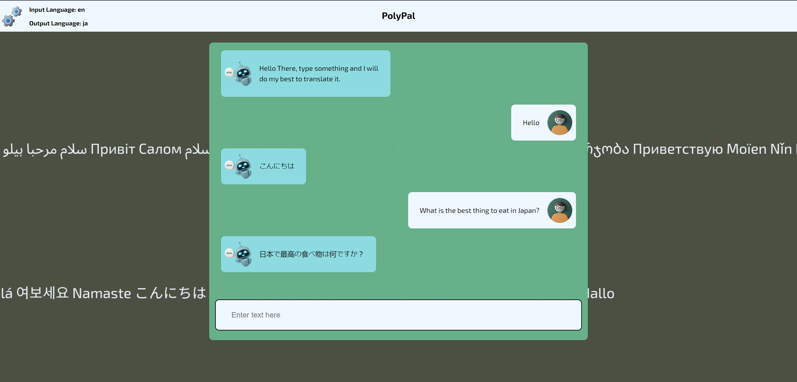

### React + Vite

## URL: https://poly-glot-pal-translating-text-app.vercel.app/

# PolyGlotPal

This app is a messaging app where whatever you type is translated via an api.

This app is only optimized for a desktop screen. If your screen is smaller or larger, results may vary.

To use the app you need to get your own api key via this [link](https://rapidapi.com/translated/api/mymemory-translation-memory)

to run this app simply run

`cd PolyGlotPag`\
`npm run dev`

don't forget to add your api key to the `.env` file 

## Screenshot

